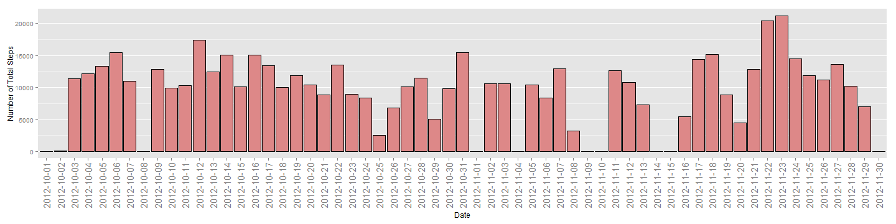
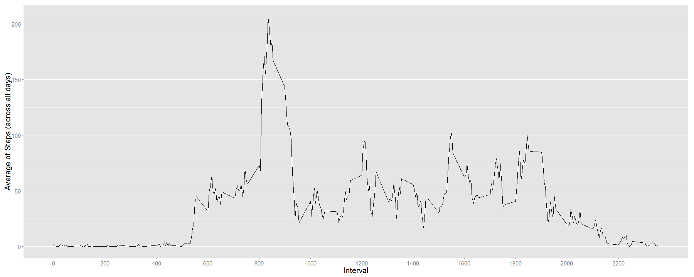
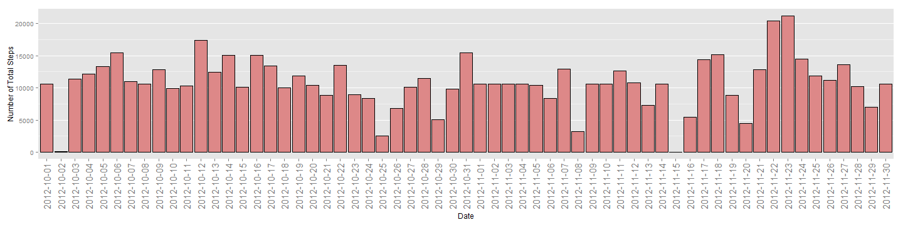
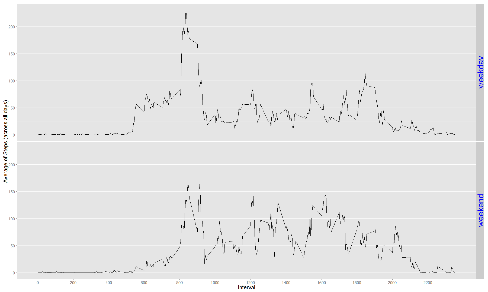

# Reproducible Research: Peer Assessment 1


## Loading and preprocessing the data


```r
if (!file.exists("data")) {
    dir.create("data")    
}
filePathZip <- "./activity.zip"
filePathCsv <- "./data/activity.csv"
if (!file.exists(filePathCsv)) {
    unzip(zipfile = filePathZip, exdir = "./data")
}
df_activity <- read.csv(filePathCsv, sep=",", na.strings="NA")    
```


## What is mean total number of steps taken per day?
Histogram of the total number of steps taken each day:


```r
library(data.table)
```

```
## data.table 1.9.2  For help type: help("data.table")
```

```r
library(ggplot2)
dt_activity <- data.table(df_activity) ## create a data table from the data frame in order to use expressions for column subsetting

##  calculate sum of steps per day and set column names of new data table
dt_steps.per.day <- dt_activity[, sum(steps, na.rm=TRUE), by=date] ## group by date
setnames(dt_steps.per.day, c("Date", "Total_Steps"))
dt_steps.per.day$Date <- as.factor(dt_steps.per.day$Date) ## convert date to a factor variable

## make plot
g <- ggplot(data=dt_steps.per.day, aes(x=Date, y=Total_Steps))

## set the stat parameter for the  bar plot to "identity" so that the variable's value (instead of the count) is used for the y-axis
g <- g + geom_bar(color="black", fill="#DD8888", stat="identity")  

g <- g + ylab("Number of Total Steps") 

## scale and rotate ticks on the x-axis and hide the gird lines on x-axis
g <- g + theme(axis.text.x = element_text(angle=90, vjust=0.5, size=15))  
g <- g + theme(panel.grid.minor.x=element_blank(), panel.grid.major.x=element_blank()) 

print(g)
```

 


```r
mean <- mean(dt_steps.per.day$Total_Steps, na.rm = TRUE)
median <- median(dt_steps.per.day$Total_Steps, na.rm = TRUE)
```
The total number of steps taken per day have a mean of 9354 and a median of  10395.


## What is the average daily activity pattern?
Time series plot of the 5-minute interval and the average number of steps taken, averaged across all days:

```r
## calculate the average steps per interval (across all days) and set the column names of the new data table
dt_avg.steps.per.interval <- dt_activity[, mean(steps, na.rm=TRUE), by=interval]  ## group by interval
setnames(dt_avg.steps.per.interval, c("Interval", "Avg_Steps"))

## make plot
g <- ggplot(data=dt_avg.steps.per.interval, aes(x=Interval, y=Avg_Steps))
g <- g + geom_line()
g <- g + ylab("Average of Steps (across all days)") 
g <- g + theme(axis.title.x = element_text(size=20)) + theme(axis.title.y = element_text(size=20)) ## set size of axis labels
g <- g + theme(axis.text.x = element_text(size=15))  ## scale ticks on x-axis
g <- g + theme(axis.text.y = element_text(size=15))  ## scale ticks on y-axis

## set ticks on x-axis only for every 2 hours, i.e. every 24th interval and hide the gird lines on x-axis
g <- g + scale_x_continuous(breaks = dt_avg.steps.per.interval$Interval[seq(1, length(dt_avg.steps.per.interval$Interval), 24)])  
g <- g + theme(panel.grid.minor.x=element_blank(), panel.grid.major.x=element_blank()) 

print(g)
```

 


```r
max <- max(dt_avg.steps.per.interval$Avg_Steps, na.rm = TRUE)
max_interval <- dt_avg.steps.per.interval$Interval[which.max(dt_avg.steps.per.interval$Avg_Steps)]
```
835 is the interval with the maximum average of steps across all days, which is 206.2.


## Imputing missing values

```r
cnt_obs_na <- sum(as.integer(!complete.cases(df_activity)))
```
There are 2304 records in the data set where the value of the steps variable is missing (i.e. 'NA').

The following strategy is used to fill in the missing values for the steps variable: use the mean for that 5-minute interval (across all days). 


```r
## add new variable (avg_steps) with the avgerage steps per interval
dt_activity_imp <- dt_activity[, avg_steps := as.integer(mean(steps, na.rm=TRUE)),  by=interval] ## group by interval

## impute values of variable steps where it is missing (i.e. 'NA') using the average steps for this interval (avg_steps)
dt_activity_imp[is.na(steps), steps := avg_steps]  

## calculate the sum of steps per day and set column names of new data table
dt_steps.per.day.imp <- dt_activity_imp[, sum(steps, na.rm=TRUE), by=date]  ## group by date
setnames(dt_steps.per.day.imp, c("Date", "Total_Steps"))
dt_steps.per.day.imp$Date <- as.factor(dt_steps.per.day.imp$Date) ## convert date to a factor variable

## make plot
g <- ggplot(data=dt_steps.per.day.imp, aes(x=Date, y=Total_Steps))

## set the stat parameter for the  bar plot to "identity" so that the variable's value (instead of the count) is used for the y-axis
g <- g + geom_bar(color="black", fill="#DD8888", stat="identity")  
g <- g + ylab("Number of Total Steps") 

## scale and rotate ticks on the x-axis and hide the gird lines on x-axis
g <- g + theme(axis.text.x = element_text(angle=90, vjust=0.5, size=15))  
g <- g + theme(panel.grid.minor.x=element_blank(), panel.grid.major.x=element_blank()) 

print(g)
```

 


```r
mean_imp <- mean(dt_steps.per.day.imp$Total_Steps, na.rm = TRUE)
median_imp <- median(dt_steps.per.day.imp$Total_Steps, na.rm = TRUE)
```

The total number of steps taken per day - using the imputed data set - have a mean of 10750 and a median of  10641.

Do these estimates (mean and median) for the data set using imputed values differ from the corresponding estimates for the original data set?  
- Both estimates (mean and median) differ when using a data set with imputed values.  
What is the impact of imputing missing data on the estimates of the total daily number of steps?  
- the estimates are more representative as the presence of missing days may introduce bias into some calculations or summaries of the data.  


## Are there differences in activity patterns between weekdays and weekends?
Time series plot of the 5-minute interval and the average number of steps taken, averaged across all weekday days or weekend days:


```r
## add a new factor variable (daytype) for the day type, i.e. 'weekday' or 'weekend'
dt_activity_imp <- dt_activity_imp[, daytype := sapply(date, 
    function(d) { if (weekdays(as.Date(d, "%Y-%m-%d")) %in% c('Saturday','Sunday')) 'weekend' else 'weekday' })] 
dt_activity_imp$daytype <- as.factor(dt_activity_imp$daytype) 

##  calculate avearge of steps per interval and day type and set column names for the new data table
dt_avg.steps.per.interval.and.daytype <- dt_activity_imp[, mean(steps, na.rm=TRUE), by=c("interval", "daytype")] ## group by interval and daytype
setnames(dt_avg.steps.per.interval.and.daytype, c("Interval", "Daytype", "Avg_Steps"))

## make plot
g <- ggplot(data=dt_avg.steps.per.interval.and.daytype, aes(x=Interval, y=Avg_Steps))
g <- g + geom_line()

## create a separate panel for each type of day type,  i.e. for 'weekday' and 'weekend'
g <- g + facet_grid(Daytype ~ .) 
g <- g + theme(strip.text.y = element_text(size = 30, colour = "blue", angle = 90))

g <- g + ylab("Average of Steps (across all days)") 

# set size of the axis labels and scale ticks on the x- and y-axis
g <- g + theme(axis.title.x = element_text(size=20)) + theme(axis.title.y = element_text(size=20))
g <- g + theme(axis.text.x = element_text(size=15))  
g <- g + theme(axis.text.y = element_text(size=15))  

## set ticks on x-axis only for every 2 hours, i.e. every 24th interval and hide gird lines on x-axis
cnt_intervals <- length(dt_avg.steps.per.interval.and.daytype$Interval)
g <- g + scale_x_continuous(breaks = dt_avg.steps.per.interval.and.daytype$Interval[seq(1, cnt_intervals, 24)])  
g <- g + theme(panel.grid.minor.x=element_blank(), panel.grid.major.x=element_blank())

print(g)
```

 

The above activity patterns for weekdays and weekends show that the main difference is in the morning between 6am and 10am. Also, there seems to be a higher "activity" during a weekend day's afternoon, possible due to the fact, that on a weekday day most people are sitting in their offices.


